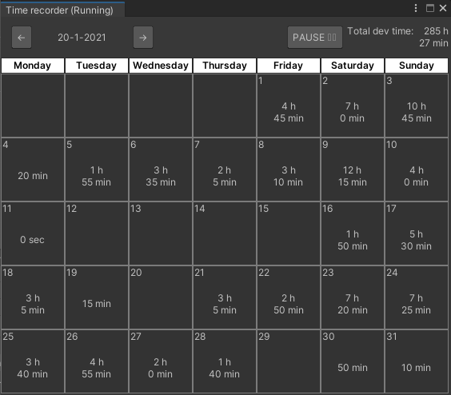
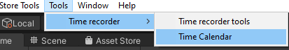
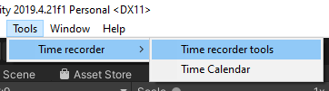
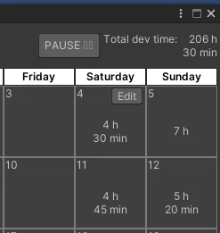
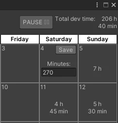
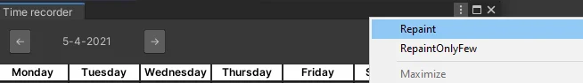

# Unity editor plugin [Time recorder]
Time recoder is an Unity Editor plugin that allow you an easy way to track develop work time while unity editor is open, track your develop time per project while this plugin is imported.

# Installation

- Install via  Asset store:

- Install via custom package: [TimeRecorder.unitypackage](./TimeRecorder.unitypackage)

# Instructions/requirements
- Make sure only copy repo assets folder into your assets/plugins folder inside your project
- Have installed UIElements package for unity

You can find the time recorder window at Tools/Time recorder

# Time recorder tools

You can find the time recorder tools at Tools/Time recorder tools

- In the case you want to make a backup of you "time recorder" data you can make a file backup with the "Generate backup" option.

- I case you want to restore your time recorded data, you can use a backup file to restore your "Time recorder" data

 

# Edit time
You can edit each day worked time by hovering the day and clicking the edit button. This function only works with the days of selected month (those days which contains the day number).

Once you clicked the edit button the content of the day will change into an input where you can update the time recoder on that day, the value must be setted as minutes.

after edit the value you can click save and it will restore the state of the element and the total dev time value will be updated also.

# Extra info
- TimeRecorder automatically start their process on open your Unity Project.
- The time that you spend on your project is saved each 5 minutes or when you close your project.
- You can change between months with the arrow buttons located in the window header.
- Month name is displayed according user os language location.
- In case of try to repaint window, you can find a custom menu option into the 3 dots window button and force repaint.
- Now you can  pause the time recorder actions

